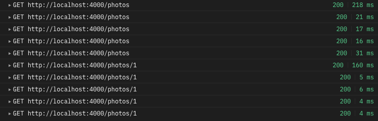

# Redis with Node JS Turorial 🚀



This guide will walk you through setting up a Node.js project with Redis to optimize backend response times significantly. By caching data in Redis, I've observed up to a 10x improvement in response times for API requests.

## Requirements
1. Node.js
2. npm (Node Package Manager)
3. Redis
4. Postman (for API testing)

## Installation and Setup
**1. Installing Redis**
First, you need to install Redis on your machine. Installation steps vary depending on your operating system:

For macOS:
```brew install redis```
For Ubuntu:
```sudo apt-get install redis-server```
For Windows:
Download and install Redis from the official .

**2. Starting the Redis Server**
Once Redis is installed, you can start the server with the following command:
```
redis-server
```
This command will start the Redis server on the default port 6379.

**3. Setting Up the Node.js Project**
***1. Clone the repository***
```
git clone https://github.com/Siddartha-Kodaboina/Redis-with-Node-Tutorial.git
```

***2.Install dependencies***
Install the required Node.js packages:
```
npm install
```

**4. Running the Node.js Server**
Start the server with nodemon to automatically restart the server on file changes:
```
nodemon index.js
```

## API Endpoints
The server defines the following endpoints:
```
GET /photos: Fetches all photos, uses Redis caching.
GET /photos/:id: Fetches a single photo by ID, uses Redis caching.
```
## Testing API Performance
To test and verify the performance optimization:

1. Open Postman.
2. Configure a GET request to http://localhost:4000/photos and http://localhost:4000/photos/:id.
3. Send the request and observe the response time.
4. Repeat the requests multiple times to see the difference in response times with and without Redis caching.

## My Performance Measurement Results

```
<p><span style="color: red;">Without Redis:</span> GET http://localhost:4000/photos<br>
<span style="color: red;">200</span> <span style="color: red;">218 ms</span></p>

<p><span style="color: green;">With Redis caching:</span> GET http://localhost:4000/photos<br>
<span style="color: green;">200</span> <span style="color: green;">21 ms</span><br>
<span style="color: green;">200</span> <span style="color: green;">17 ms</span><br>
<span style="color: green;">200</span> <span style="color: green;">16 ms</span><br>
<span style="color: green;">200</span> <span style="color: green;">31 ms</span></p>

<p><span style="color: red;">Without Redis caching:</span> GET http://localhost:4000/photos/1<br>
<span style="color: red;">200</span> <span style="color: red;">160 ms</span></p>

<p><span style="color: green;">With Redis caching:</span> GET http://localhost:4000/photos/1<br>
<span style="color: green;">200</span> <span style="color: green;">5 ms</span><br>
<span style="color: green;">200</span> <span style="color: green;">6 ms</span><br>
<span style="color: green;">200</span> <span style="color: green;">4 ms</span><br>
<span style="color: green;">200</span> <span style="color: green;">4 ms</span></p>

```


## Conclusion
By integrating Redis into my Node.js or backend application, we can drastically reduce the response times for our API endpoints, enhancing the overall performance and user experience.